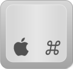

# Sublime 
# your code

Presentation available at    
[http://aug-riedinger.github.io/sublime-tips](http://aug-riedinger.github.io/sublime-tips)
--
## Access your code

#### Among the project

|                                    |  |  |
|:----------------------------------:|:--------------------------------:|:---------------------:|
|     Access a file with filename    |             +             |        +        |
| Access a file with snippet of code |         +  +         |    +  +   |

--
## Access your code

#### Within the opened file
|                                    |  |  |
|:----------------------------------:|:--------------------------------:|:-----------------------------:|
|     Access line number             |  +  |  +        |
|     Access symbol                  |             +             |        +        |
|     Move to next word *             |  +  |  +        |
|     Move to previous word *             |  +  |  +        |
|     Move to end of line *             |  +  |  +        |
|     Move to beginning of line *             |  +  |  +        |

> \* Press  to keep selection 

--
## Move your code

|                   |  |   |
|:-----------------:|:--------------------------------:|:------------------------------:|
|  Duplicate a line |         +  +         |        +  +        |
| Move up line |   +  +   |  +  +  |
| Move down line |   +  +   |  +  +  |
|  Move right  |                   |                 |
|  Move left  |          +         |         +        |
|   Comment/Uncomment a line  |         +  +         |        +        |

> You barely never need multiple-line comments

--
## Multiple Edits

|                                |  |  |
|:------------------------------:|:--------------------------------:|:-----------------------------:|
|     Create multiple cursor     |           + Click          |          + Click        |
|   Select multiple occurrences  |             +             |            +           |
|      Undo select operation     |             +             |     +                            |
| Break line in multiple cursors |             +             |            +           |
| Break line in multiple cursors |         +  +         |        +  +       |

--
## Customize

Add a reindent shortcut
```
{ 
  "keys": ["f10"], 
  "command": "reindent", 
  "args": {
    single_line": false
  }
}
```

--
## Usefull Plugins

Install [plugins](https://sublime.wbond.net/installation):  +  +  --> `Install Package`

- [Sidebar enhancement](https://github.com/titoBouzout/SideBarEnhancements) (Sublime 3 only, [Install on ST2](https://github.com/titoBouzout/SideBarEnhancements/issues/172))
- [ChangeQuotes](https://github.com/colinta/SublimeChangeQuotes) 
- [Gitgutter](https://github.com/jisaacks/GitGutter)
- [BracketHighlighter](https://github.com/facelessuser/BracketHighlighter)

> Want to create yours?    
> Plugins are open source, written in Python.
  

You should **never** work without syntaxic coloration!

--
## Extra: Usefull terminal aliases 1/2

Working with Heroku in multiple environment?

Add to your `~/code/dotfiles/aliases`

```
dev() {
  nocorrect heroku $* --app <APPNAME>-dev
}

prod() {
  nocorrect heroku $* --app <APPNAME>
}
```

And set your git remotes to those:

```
$ git remote -v
> origin  git@github.com:<REPONAME>/<APPNAME>.git
> dev git@heroku.com:<APPNAME>-dev.git
> prod  git@heroku.com:<APPNAME>.git
```

--
## Extra: Usefull terminal aliases 2/2
Then you can use in the terminal: 
```
git push dev master
dev run rake db:migrate
git push prod master
prod run rake db:migrate # <=> heroku run rake db:migrate --app <APPNAME>
prod run logs --tail # <=> heroku run logs --tail --app <APPNAME>
```
--
## Enjoy Coding with Sublime

You can practice by downloading this [file](practice.html)    
and apply the following changes:

- Correctly indent the file
- Change dates 2013 to 2014
- Add `target="_blank"` to every `<a>` tag